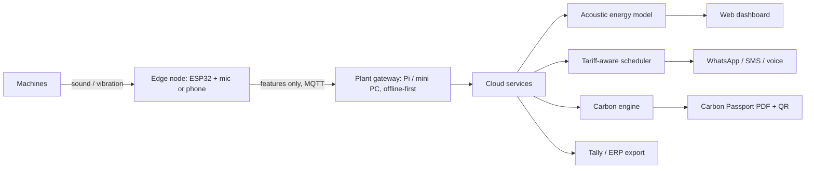

# UrjaVaani: Hear. Schedule. Prove.

A wiring-free energy and carbon platform for Indian SME manufacturers.
Built for **Yuva Yoddha Hackathon, Challenge 04: Smart Manufacturing (Industrial Energy & Process Efficiency)**.

| Module | What it does |
|---|---|
| **Hear** | Estimates per-machine load, kWh, air leaks and early faults from sound and vibration (no wiring, no shutdown) |
| **Schedule** | Plans the day around time-of-day tariffs, order deadlines and solar hours, and sends the plan on WhatsApp |
| **Prove** | Converts measured batch energy into a per-batch carbon footprint (GHG Protocol Scope 1 + 2) and a QR-coded Carbon Passport |

**Team:** Harshit Singh (team lead), Mohita Nagar (CSE core), VIT Bhopal

> Status: scaffold. Numbers in `config/` are illustrative and must be replaced with current tariff and emission-factor sources.
> Savings figures in the pitch are modelled targets until validated by the prototype.

---

## Problem in one paragraph

Industry uses 35-40% of India's energy, and energy is 15-30% of production cost in many SME sectors, yet most SMEs have no real-time energy monitoring. Smart meters are costly and hard to install, so leaks, idle running and peak-tariff operation go unnoticed, and exporters cannot easily prove emissions to buyers.

## Architecture (summary)



Details: [`docs/architecture.md`](docs/architecture.md).

## Repository structure

```
urjavaani/
├── README.md
├── requirements.txt
├── pytest.ini
├── .gitignore
├── config/                     # tariff + emission-factor tables (illustrative examples)
├── data/
│   ├── raw/                    # recordings, meter logs (not committed)
│   ├── processed/              # features, cleaned datasets (not committed)
│   └── external/               # public datasets and reference tables (not committed)
├── docs/
│   ├── architecture.md         # system design and data flows
│   ├── assumptions.md          # every assumption, with source or "to validate"
│   ├── baseline-methodology.md # how SEC and emissions baselines are defined
│   ├── data-sources.md         # datasets, tariff orders, emission factors
│   ├── diagrams/               # architecture / deployment diagrams
│   └── design/                 # dashboard wireframes, WhatsApp message mock-ups
├── edge/
│   └── firmware/               # intended ESP32 + microphone node (notes only)
├── notebooks/                  # exploration and model experiments
├── pitch/                      # presentation deck
├── scripts/                    # data generation, evaluation, demo runners
├── src/urjavaani/
│   ├── sensing/                # Hear: features.py, energy_model.py
│   ├── scheduler/              # Schedule: planner.py
│   ├── carbon/                 # Prove: engine.py, passport.py
│   ├── notify/                 # whatsapp.py (mock first)
│   ├── api/                    # FastAPI service
│   └── simulation/             # synthetic plant data
├── dashboard/                  # Streamlit app
└── tests/
```

## Quick start

```bash
python -m venv .venv && source .venv/bin/activate    # Windows: .venv\Scripts\activate
pip install -r requirements.txt
pytest                                               # runs the starter tests
uvicorn urjavaani.api.main:app --reload --app-dir src   # API
streamlit run dashboard/app.py                          # dashboard
```

---

## Work phases

Phases are sequential in intent but overlap in practice. Durations are relative; stretch or compress them to your submission deadline. The suggested split is a starting point: Harshit leads architecture, scheduler and integration; Mohita leads the sensing model and data. Both review the carbon logic and the write-up.

### Phase 0: Foundations and research
**Goal:** agree on scope, sources and definitions before building.
- Set up the repo, branches and issue board.
- Choose one target sector and machine set (for example a foundry or plastics unit: motor, air compressor, blower, furnace).
- Collect reference data: your state's current time-of-day tariff order, the latest CEA grid emission factor, BEE benchmarks for the chosen sector.
- Review prior work on acoustic motor monitoring and factory load shifting so the write-up cites it honestly.
- Fix the **baseline definition** (see `docs/baseline-methodology.md`).

**Deliverables:** `docs/assumptions.md`, `docs/data-sources.md`, `docs/baseline-methodology.md`.
**Exit criteria:** tariff table and emission factor are sourced; sector and machines are chosen; baseline metric (kWh per unit of good product) is written down.

### Phase 1: Data and simulation
**Goal:** have data to build and demonstrate against, even without a factory.
- Download public machine-sound datasets (see `docs/data-sources.md`) and record your own samples (fan or motor at several speeds with a phone).
- If possible, log a reference clamp-meter reading for each recording.
- Build a synthetic plant simulator: hourly kW per machine, shifts, orders, with an idle/leak waste component.
- Produce the **baseline week**: energy, cost, emissions and kWh per unit.

**Deliverables:** `src/urjavaani/simulation/`, `data/processed/` datasets, a baseline report in `notebooks/`.
**Exit criteria:** a reproducible baseline week with total kWh, cost and kg CO2e; clearly labelled synthetic vs real data.

### Phase 2: Hear, acoustic energy model
**Goal:** estimate per-machine kW and detect waste from sound.
- Implement feature extraction in `sensing/features.py` (spectral and band-energy features, line-frequency harmonics).
- Train a regressor for kW from features, with one-point calibration against a clamp-meter reading.
- Add simple anomaly flags: air-leak signature, idle running, abnormal vibration.
- Report accuracy honestly (MAPE on held-out data) and state where it is not good enough.

**Deliverables:** `sensing/` module, evaluation notebook, accuracy table.
**Exit criteria:** documented error on held-out data; target roughly +/-10-15% after calibration (adjust the claim to what you actually measure).

### Phase 3: Schedule, tariff-aware planner
**Goal:** cut cost by moving flexible loads without missing deadlines.
- Model jobs (kW, duration, earliest start, deadline) and the tariff table.
- Start from the greedy cheapest-window planner in `scheduler/planner.py`, then upgrade to OR-Tools CP-SAT with constraints (shift hours, machine conflicts, peak-demand cap, solar window).
- Compare the optimised plan with the baseline week from Phase 1.

**Deliverables:** `scheduler/` module, tests, cost and kWh comparison.
**Exit criteria:** every job still meets its deadline (throughput preserved); cost reduction is computed against the Phase 1 baseline.

### Phase 4: Prove, Carbon Passport
**Goal:** turn measured energy into a buyer-ready footprint.
- Finish `carbon/engine.py`: Scope 2 from hourly kWh and emission factors, Scope 1 from fuel inputs, kg CO2e per unit.
- Build `carbon/passport.py`: PDF with batch details, method, factors used, and a QR code linking to a verification page.
- Document the method and its limits (location-based Scope 2, emission factor source and year).

**Deliverables:** carbon engine, sample passport PDF, method note.
**Exit criteria:** a sample batch produces a passport whose numbers can be traced back to inputs and factors.

### Phase 5: Integration and user interface
**Goal:** one working loop a judge can see.
- Wire the modules through the FastAPI service.
- Build the Streamlit dashboard: per-machine energy, tomorrow's plan, savings tracker, Carbon Passport download.
- Implement the daily plan message in `notify/whatsapp.py` (console mock first; WhatsApp Business API or sandbox if available).
- Add Tally/ERP-friendly CSV export.

**Deliverables:** running API and dashboard, sample WhatsApp message output, CSV export.
**Exit criteria:** from a data file, one command produces the plan, the savings number and the passport.

### Phase 6: Evaluation and quantified impact
**Goal:** produce the numbers the challenge asks for.
- Run baseline vs optimised for the simulated plant (and real samples where available).
- Report specific energy consumption (kWh per unit of good product), cost per unit and emissions intensity, with throughput and rejection rate unchanged.
- Run sensitivity checks (tariff structure, share of flexible load, model error) and state assumptions.
- Compute installation cost and payback using the hardware list and subscription price.

**Deliverables:** `notebooks/evaluation.ipynb`, results table and charts, payback worksheet.
**Exit criteria:** one clear headline result with the baseline, method and assumptions stated; no figure without a source or a stated model.

### Phase 7: Submission artefacts
**Goal:** package everything the hackathon asks for.
- Solution write-up: mechanism, key assumptions, fit with Indian SME conditions.
- Architecture diagram and deployment schematic (`docs/diagrams/`).
- Dashboard wireframes and data model (`docs/design/`).
- Deployment and business-model plan: target segment, installation cost, payback, scale-up.
- Update the deck in `pitch/` with final measured numbers; record a short demo video.

**Deliverables:** write-up, diagrams, wireframes, updated deck, demo video link.
**Exit criteria:** every submission item in the Challenge 04 brief is covered and cross-checked against this README.

### Phase 8: Pilot and scale (post-hackathon roadmap)
| Stage | Timeframe | Focus |
|---|---|---|
| Prototype | 0-2 months | Working models, scheduler, carbon engine, dashboard |
| Pilot | 2-6 months | 3-5 plants in one cluster; calibrate, measure baseline, validate savings |
| Launch | 6-12 months | Subscription rollout, Carbon Passport for exporters, association partnerships |
| Scale | 12-24 months | Multiple clusters and states, federated benchmarking, retrofit marketplace |

---

## Risks and how we handle them

| Risk | Mitigation |
|---|---|
| Acoustic estimates are less accurate than a meter | One-point calibration; report measured error; use for ranking waste and scheduling, not billing |
| No real factory data | Public datasets, own recordings, clearly labelled synthetic simulation |
| Prior art exists for each component | Cite it; claim the integrated SME package, not a "first" |
| Tariffs and emission factors change | Keep them in `config/`, source and date them |
| Scope creep | Finish Phases 1-6 before any extras such as federated benchmarking |

## Contributing workflow
- Branch per phase or feature (`phase-2-acoustic-model`); open a pull request; the other member reviews.
- Keep data out of git (see `.gitignore`); share links to datasets in `docs/data-sources.md`.
- Add or update tests when changing `carbon/` or `scheduler/`.

## License
Apache2.0
